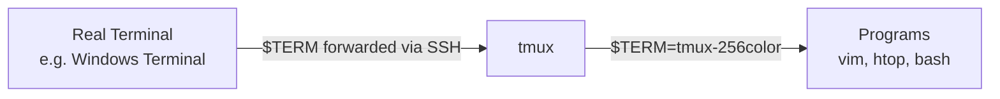

# Tmux & Terminal Concepts

A structured guide to tmux configuration and terminal color systems, covering how terminals communicate capabilities, how tmux manages colors, and how to build a custom status bar.

---

## 📺 Terminal Architecture

### How Tmux Fits In

Tmux is a **terminal multiplexer** — it sits between your real terminal and the programs running inside it. Each pane in tmux is a virtual terminal.

There are two layers of communication:



1. **Outer layer** — your real terminal (Windows Terminal, iTerm2, Alacritty) → tmux
2. **Inner layer** — tmux → programs inside panes (vim, htop, etc.)

### Remote Connection Flow

When you SSH into a machine:

1. Your local terminal (e.g., Windows Terminal) sets `$TERM=xterm-256color` locally
2. The **SSH client** forwards this `$TERM` value to the remote server
3. Tmux reads `$TERM` and looks up the terminal's capabilities in the **terminfo database**
4. Programs inside tmux get `$TERM=tmux-256color` (set by tmux's `default-terminal` option)

> The server doesn't know you're using Windows Terminal — it just sees `xterm-256color`. Most modern terminals identify as `xterm-256color` because it's universally supported.

---

## 🎨 Terminal Color Systems

### Evolution of Terminal Colors

| Generation | Colors | How It Works |
|---|---|---|
| **4-bit (ANSI)** | 16 | 8 named colors + 8 bright variants. The original terminal colors. |
| **8-bit (256)** | 256 | 16 ANSI + 216 color cube (6x6x6) + 24 grayscale shades. |
| **24-bit (True Color)** | 16,777,216 | Full RGB — 3 channels (R, G, B) x 256 values each. Written as hex: `#RRGGBB`. |

True color is called "true color" because it roughly matches what the human eye can distinguish.

### How Programs Detect Color Support

Programs check two environment variables:

- **`$TERM`** — looked up in the **terminfo database** to determine basic capabilities (how many colors, cursor control, key codes, etc.)
- **`$COLORTERM`** — if set to `truecolor` or `24bit`, programs know they can use full 24-bit RGB colors

Example: Vim reads `$TERM` for basic capabilities, then checks `$COLORTERM` (or `set termguicolors`) to decide whether to use 24-bit colors.

### The Terminfo Database

A system database at `/usr/share/terminfo/` that stores what each terminal type can do.

- Organized by first character: `t/tmux-256color`, `x/xterm-256color`, etc.
- Programs look up their `$TERM` value here to learn the terminal's capabilities
- Inspect an entry with: `infocmp tmux-256color`
- The database ships entries for **all known terminals** (even ancient ones like VT100), not just what's installed — because someone might SSH in from any terminal

**The key problem:** the terminfo database often lags behind what modern terminals actually support. For example, `xterm-256color` doesn't mention true color, even though Windows Terminal, iTerm2, and Alacritty all support it. This is why `terminal-overrides` exists in tmux — to patch in capabilities the database doesn't know about.

---

## ⚙️ Tmux Configuration

### Enabling True Color

Two settings work together:

```bash
# Inner layer: tell programs inside tmux they have 256-color support
set -g default-terminal "tmux-256color"

# Outer layer: tell tmux the real terminal supports true color
set -ga terminal-overrides ",*256col*:Tc"
```

- `default-terminal` sets `$TERM` inside every pane → programs know they have at least 256 colors
- `terminal-overrides` patches the terminfo lookup → tmux passes 24-bit colors through instead of downgrading to 256

Without the override, hex colors like `#073642` get approximated to the nearest 256-color match — which looks slightly wrong.

---

## 🖥️ Status Bar

### Structure

The tmux status bar has three sections:

```
[status-left] [window-list] [status-right]
```

- **status-left** — defaults to `[session_name]`
- **window-list** — shows all windows (controlled by `window-status-format` and `window-status-current-format`)
- **status-right** — defaults to `"pane_title" HH:MM DD-Mon-YY`

### Key Options

| Option | Purpose |
|---|---|
| `status-style` | Background/foreground of the entire bar |
| `status-left` | Content on the left |
| `status-right` | Content on the right |
| `status-right-length` | Max character length for right side (default: 40) |
| `window-status-format` | How inactive windows are displayed |
| `window-status-current-format` | How the active window is displayed |

### Inline Styling

Use `#[...]` to change colors within a segment:

```bash
#[fg=#b58900]       # set text color
#[bg=#073642]       # set background color
#[fg=#b58900,bold]  # combine attributes
```

Each `#[...]` applies until the next one.

### Dynamic Content

- **Tmux variables:** `#{pane_current_path}`, `#{pane_title}`, `#I` (window index), `#W` (window name)
- **Shell commands:** `#(command)` runs a command and inserts its output
- **Conditionals:** `#{?condition,true_value,false_value}` for conditional display

### Pane Title vs Hostname

The default status-right shows `"#{=21:pane_title}"` — this is the **pane title**, not the hostname. The pane title is set dynamically by the running program via escape sequences, so it changes depending on what you're doing (bash shows `user@host: /path`, vim shows the filename, etc.).

### Mode Indicator

Tmux modes can be detected with conditionals:

- `#{client_prefix}` — 1 when prefix key is pressed (waiting for next key)
- `#{pane_in_mode}` — 1 when in copy mode (scrollback/selection)

There are 5 modes total: **normal**, **prefix**, **copy**, **command** (`:` prompt), and **choose** (selection menus). Most status bars only track normal, prefix, and copy.

---

## 🌈 Solarized Dark Theme

Designed by Ethan Schoonover. Originally created in the 16-color ANSI era — colors are defined as exact hex values (true color) but were designed to work by remapping the 16 ANSI color slots in terminal emulator settings. With true color support, the hex values can be used directly without remapping.

### Base Colors (Monotones)

| Name | Hex | Role |
|---|---|---|
| base03 | `#002b36` | Main background |
| base02 | `#073642` | Highlighted/selected background |
| base01 | `#586e75` | Comments, secondary text |
| base00 | `#657b83` | Body text (light mode only) |
| base0 | `#839496` | Default body text (dark mode) |
| base1 | `#93a1a1` | Emphasized text, headings |
| base2 | `#eee8d5` | Background (light mode only) |
| base3 | `#fdf6e3` | Main background (light mode only) |

### Accent Colors

| Name | Hex | Typical Usage |
|---|---|---|
| yellow | `#b58900` | Warnings, constants, numbers |
| orange | `#cb4b16` | Types, declarations |
| red | `#dc322f` | Errors, deletions |
| magenta | `#d33682` | Keywords, special |
| violet | `#6c71c4` | Verbose, less important keywords |
| blue | `#268bd2` | Functions, identifiers |
| cyan | `#2aa198` | Strings, literals |
| green | `#859900` | Additions, success |

### Dark vs Light Mode

The base colors flip: `base03`↔`base3`, `base02`↔`base2`, `base01`↔`base1`, `base00`↔`base0`. The 8 accent colors stay the same for both modes.

---

## 📅 Time Format

### ISO 8601

The international standard for date/time: `2026-04-01T14:30`. Unambiguous and sortable.

ISO 8601 doesn't include day-of-week names — it uses week numbering instead (`2026-W14-3`). A common informal extension is:

```
2026-04-01 Wed 14:30
```

This combines ISO date (unambiguous, sortable) + day name (human-friendly) + 24-hour time (no AM/PM confusion). Widely used in developer/tech contexts: git logs, CLI tools, status bars, log files.

---

## 🔌 Tmux Plugins vs Native

### TPM (Tmux Plugin Manager)

Install: `git clone https://github.com/tmux-plugins/tpm ~/.tmux/plugins/tpm`

Usage in config:
```bash
set -g @plugin 'tmux-plugins/tpm'
set -g @plugin 'tmux-plugins/tmux-sensible'
run '~/.tmux/plugins/tpm/tpm'
```

Press `prefix + I` to install plugins.

### tmux-sensible

Sets "everyone should have these" defaults: `escape-time 0`, `history-limit 50000`, `status-interval 5`, 256-color support, `prefix + R` to reload config. Never overrides your settings. Most of these are just a few lines you can add yourself.

### tmux-powerline Segments

Provides 50+ status bar segments (CPU, memory, git branch, weather, etc.). Most are "cool but not practical" given limited status bar space. The ones that earn their space:

- Mode indicator
- Git branch
- Current path
- Time

### Native vs Plugin

Simple info (time, session, path) → use tmux config directly. Dynamic info (git branch, CPU) → use `#(command)` inline. Complex multi-line logic → use a separate bash script. Plugins are rarely necessary — most features can be done natively.

---

## 🗂️ Dotfiles Management

### Symlink Approach

Store configs in a git repo, symlink them to their expected locations:

```bash
ln -sf ~/git-repos/dotfiles/tmux/.tmux.conf ~/.tmux.conf
```

### GNU Stow

A symlink farm manager. Automatically creates symlinks based on directory structure:

```bash
cd ~/dotfiles
stow -t ~ tmux    # symlinks tmux/.tmux.conf → ~/.tmux.conf
```

### Install Script

A `install.sh` that creates all symlinks. Uses `$(cd "$(dirname "$0")" && pwd)` to resolve the script's absolute path regardless of where it's run from.
